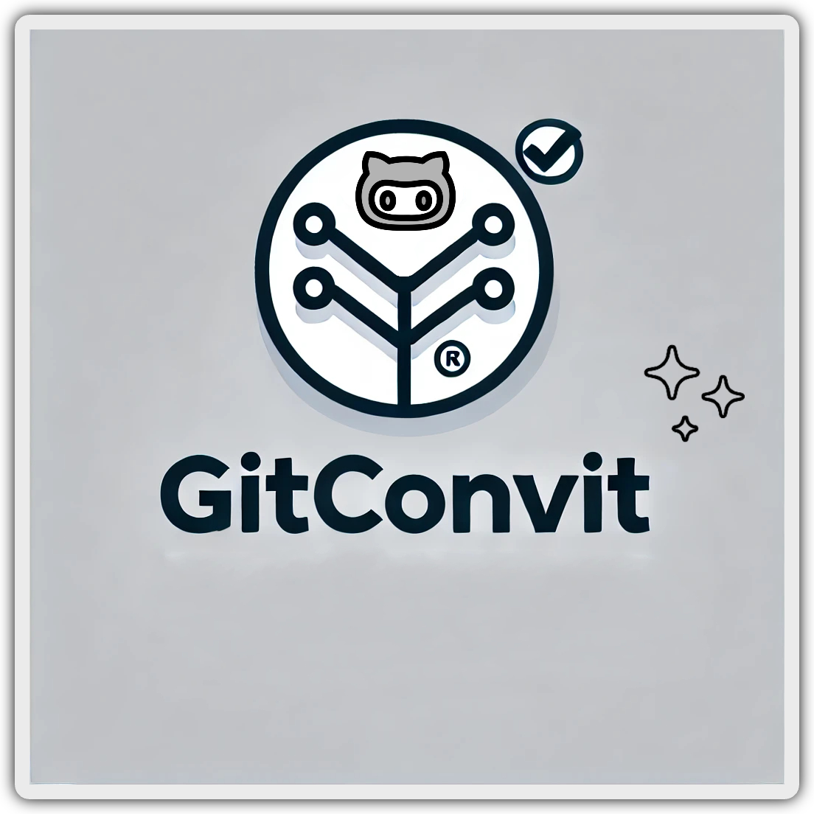
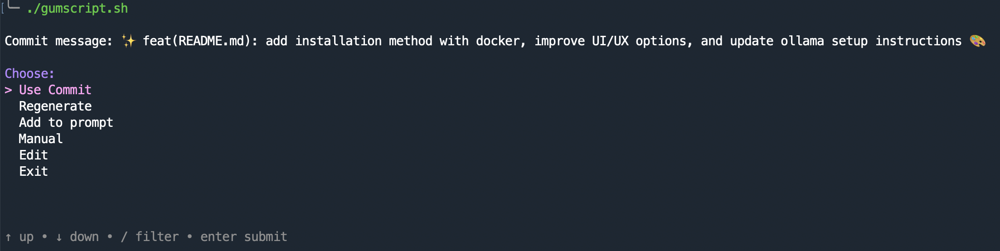
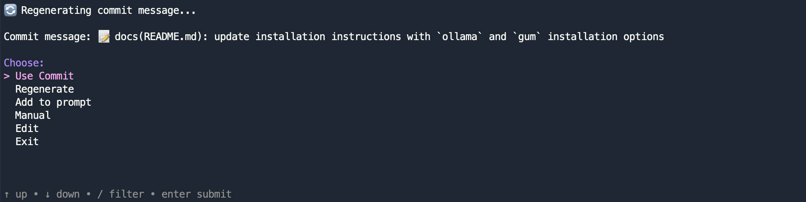
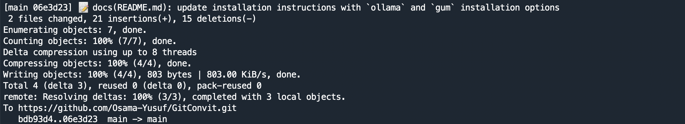

<div align="center">
   <!-- <h1>GitConvit</h1> -->
    
        <p>GitConvit, an AI-powered tool that generates conventional commit messages with emojis based on the changes in your Git repository.</p>
</div>

---
This tool leverages the `llama3:latest` model from `ollama` to create commit messages that follow conventional commit standards, ensuring that your commit history is informative and well-structured.

## Features
- Automatically detects changes in your Git repository.
- Generates conventional commit messages with appropriate emojis.
- Interactive prompt to confirm or regenerate the commit message along other options.
- Ensures that all changes are committed with a single, informative message.

## Emojis and Categories

The following categories and emojis are used for generating commit messages:

- `docs`: 📝
- `feat`: ✨
- `fix`: 🐛
- `style`: 🎨
- `refactor`: 🔨
- `chore`: 🚀
- `config`: ⚙️

## Screenshots 








## Prerequisites

1. **Install `ollama`**:
   - Download and install `ollama` from [ollama's official website](https://www.ollama.com/download).
   - Ensure that `ollama` is running and accessible at `http://localhost:11434`.
   - Pull the `latest` version of the `llama3` model. with the following command:
        ```bash
        ollama pull llama3:latest
        ```
2. **Install `gum` (Optional for Enhanced UI/UX)**:
    - If you want to use the `gum` enhanced script:
      ```bash
        # macOS or Linux
        brew install gum

        # Arch Linux (btw)
        pacman -S gum

        # Windows (via WinGet or Scoop)
        winget install charmbracelet.gum
        scoop install charm-gum
      ```
    - More installation methods [here](https://github.com/charmbracelet/gum#Installation).

## Why Three Scripts?

To cater to different user preferences and environments, we provide three versions of the script:

1. **Python Script (`script.py`)**:
    - For users who prefer Python and want a straightforward approach without additional dependencies.

2. **Bash Script without Dependencies (`script.sh`)**:
    - For users who prefer a bash script without any additional dependencies. This version has a basic user interface and functionality.

3. **Bash Script with `gum` (`gumscript.sh`)**:
    - For users who want a significantly enhanced user experience with a modern, interactive UI. This version requires the `gum` tool to be installed.

You can choose the version that best fits your needs and preferences.


## Installation

1. **Clone the Repository**:
    ```bash
    git clone https://github.com/Osama-Yusuf/GitConvit.git
    cd GitConvit
    ```

2. **Make the Script Executable**:
    ```bash
    chmod +x gumscript.sh
    ```

3. **Install Dependencies**:
    - Ensure you have `jq` installed for processing JSON responses:
      ```bash
      sudo apt-get install jq
      ```

4. **Add the Script to your bin directory**:
    ```bash
    sudo cp gumscript.sh /usr/local/bin/gitconvit
    ```

## Usage

To generate and use a conventional commit message, run the script:

```bash
gitconvit
```

#### Script Workflow

1. Check if you are in a Git repository.
2. Detect the changed files.
3. Generate a commit message using the AI model.
4. Prompt you to confirm or regenerate the commit message.
5. Commit and push the changes to your repository.

### Detailed Steps

1. **Check if the Current Directory is a Git Repository**:
    
    * The script ensures that the current directory is a Git repository before proceeding.
2. **Get Changed Files and Diffs**:
    
    * The script uses `git diff --name-only` and `git diff` to get the list of changed files and their diffs.
3. **Generate Commit Message**:
    
    * The script sends the changes to the AI model `llama3:latest` from `ollama` to generate a conventional commit message with an appropriate emoji.
    * The commit message follows the format specified by conventional commits.
4. **Interactive Confirmation**:
    
    * The script prompts you to either accept the generated commit message, regenerate it by pressing `r`, or abort by pressing `CTRL+C`.
5. **Commit and Push**:
    
    * Once confirmed, the script adds all changes, commits them with the generated message, and pushes to the current branch.

## Example

Here is an example of how the commit message might look:

```text
📝 docs(README.md): added installation method with docker
```

### Todo

- [ ] Add a flag to select different ollama model than llama3
- [ ] Add a flag to select different ai model than ollama like openai models or google gemeni or grok
- [ ] Add a tutorial GIF in the readme file
- [ ] Add an (add) option that will list all files changed and user can multiselect files with gum/fzf/case
- [ ] Make the emojis optional
- [X] Add an option to edit the AI output
- [X] Add an option to pass a prompt to the initial main prompt
- [X] Add an option to create the convential commit manually by taking three inputs the category, the context, and a short description
- [X] Add an option to recreate the AI output

## Contributing

Contributions are welcome! Please fork the repository and create a pull request with your changes.

## License

This project is licensed under the MIT License. See the LICENSE file for details.

## Contact

For any inquiries or support, please contact [Osama Yusuf](https://github.com/Osama-Yusuf).
